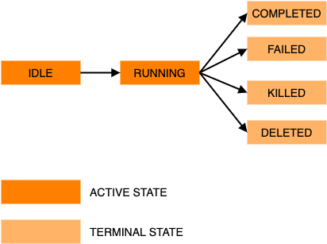

# Job lifecycle
The state diagram below shows the possible job states.

List of all possible job states:
* __idle__: the job is not yet running.
* __running__: the job is runing.
* __deleted__: the job has been deleted by the user.
* __killed__: the job has been forcefully terminated, for example it had been running for too long.
* __completed__: the job has completed, however note that the exit status may or may not be 0.
* __failed__: the job failed, for example the infrastructure could not be deployed successfully or the container image could not be pulled.

